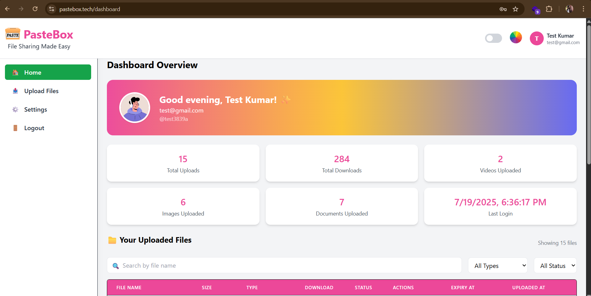
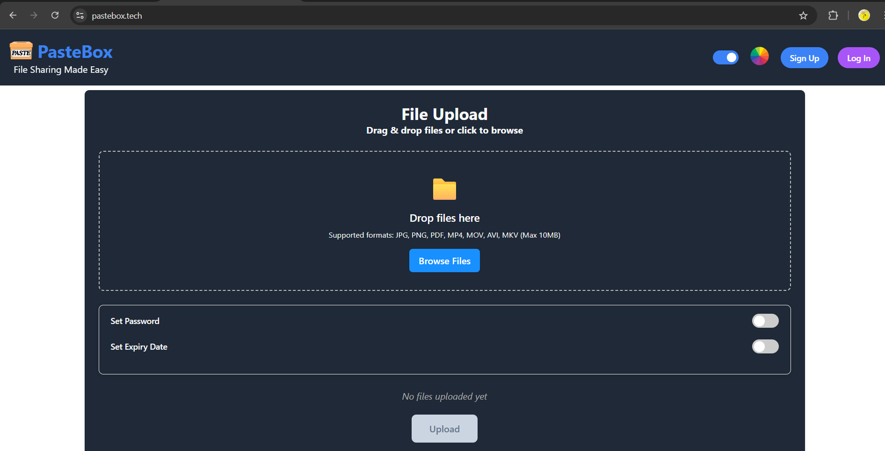
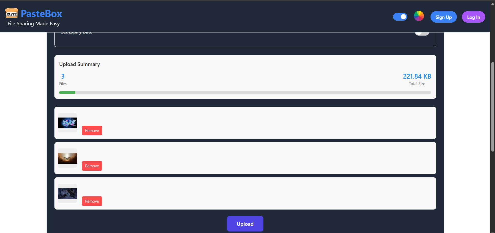
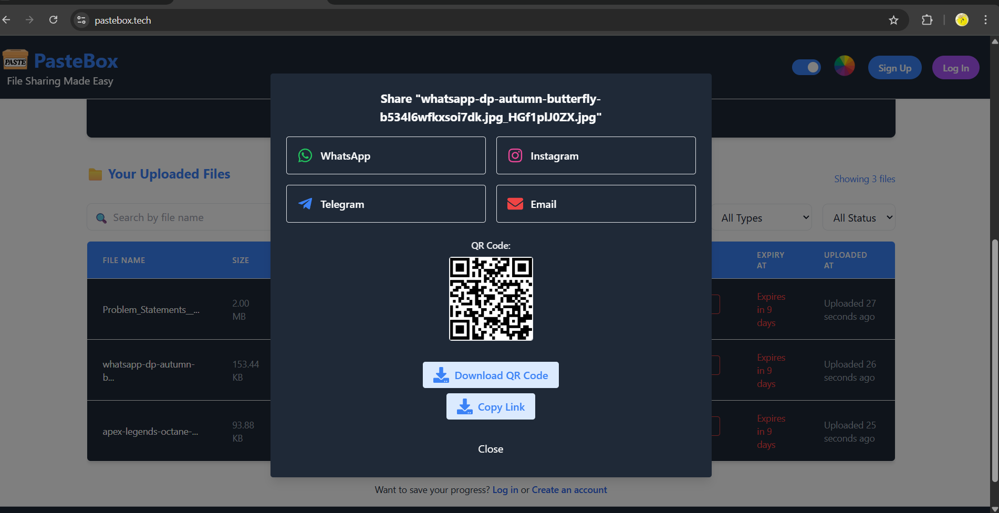
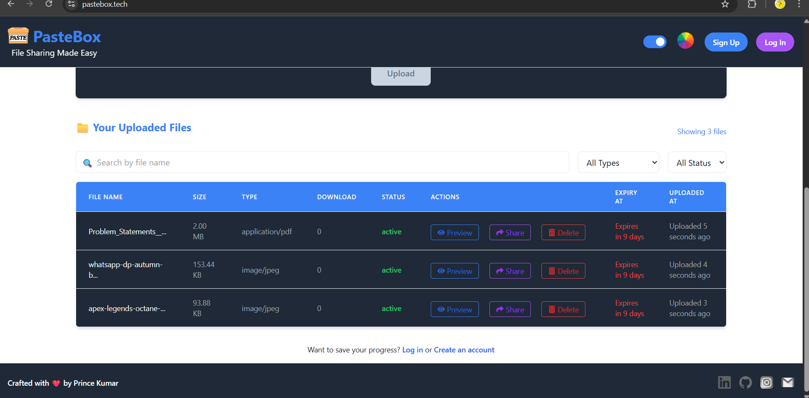

# 📦 PasteBox — Secure, Fast & Smart File Sharing Platform

[]()
[]()
[]()

**PasteBox** is a modern file-sharing and storage platform that lets users instantly upload files and generate short, shareable download links or QR codes. With a clean UI, lightning-fast uploads (via AWS), and optional user authentication, PasteBox is designed for both casual and power users.

Live Demo (Coming Soon) | Powered by MERN + AWS

---

## ✨ Features

### 🚀 General Features

- ⚡ Fast file uploads via AWS S3 & MongoDB GridFS
- 🔐 JWT-based authentication (Login/Register)
- 🧾 Dashboard for managing uploaded files
- 💾 Anonymous sharing via LocalStorage
- 🔗 Share links with QR Codes, WhatsApp, Email, Facebook, etc.
- 📅 Expiration countdown for temporary files
- 📤 Download/Preview features with tracking
- 🌐 SEO-optimized public pages
- 📈 Progress indicators, spinners, and toasts for smooth UX

---

### 📡 Sharing Options

- Share links via:
  - WhatsApp
  - Instagram
  - Email
  - Direct QR Code
- Copy link with one click

### ⚙️ Backend & Storage

- Uses **AWS S3** for fast and reliable file storage
- GridFS support for large file uploads
- Secure token-based API authentication
- Supports file compression and preview links

---

## 🛠️ Tech Stack

### 🔹 Frontend

- **React 18**
- **React Router DOM**
- **Tailwind CSS** (for styling)
- **Redux Toolkit** (for state management)
- **React Dropzone** (for file drag-and-drop)
- **React Toastify** (for notifications)
- **React QR Code** & **React Share** (for QR and social sharing)
- **Vite** (blazing fast dev server)

### 🔸 Backend

- **Node.js** + **Express**
- **MongoDB** + **Mongoose**
- **AWS SDK** (for S3 uploads)
- **Multer** + **GridFS**
- **JWT** (authentication)
- **ShortID** (for short link generation)
- **QRCode** (for QR generation)
- **Nodemailer** (for potential email sharing)

---

## 📸 Screenshots

### 👤 User Dashboard



### 👥 Guest Dashboard



### 📤 File Upload Panel



### 🔗 File Share Options



### 🔍 File Preview Window



## 📂 Project Structure


> _The structure image above shows the separation of the React frontend (`client/`) and Node.js backend (`server/`), including components, routes, controllers, models, and config folders._

---

## ⚙️ Installation & Running Locally

### 📦 Requirements

- Node.js
- MongoDB (local or Atlas)
- AWS credentials with S3 bucket

### 🧑‍💻 1. Clone the repository

```bash
git clone https://github.com/PrinceInScripts/Share-Pod-File-Sharing-Application

cd client
npm install
npm run dev

cd server
npm install
npm start


PORT=6600
MONGODB_URL=your_mongo_url
SERVER_URL=http://localhost:6600/api/files
CLIENT_URL=http://localhost:5173
NODE_ENV=development
JWT_SECRET=your_jwt_secret

AWS_ACCESS_KEY_ID=your_aws_access_key
AWS_SECRET_ACCESS_KEY=your_aws_secret
AWS_REGION=your_aws_region
AWS_BUCKET_NAME=your_s3_bucket

MAIL_USER=your_email
MAIL_PASS=your_email_password
BASE_URL=http://localhost:6600
```
